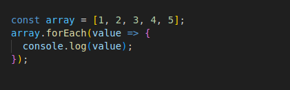
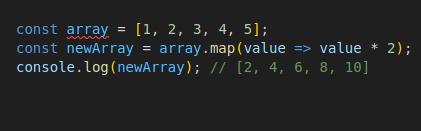
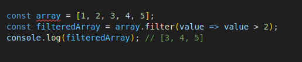
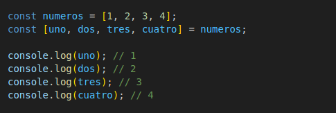
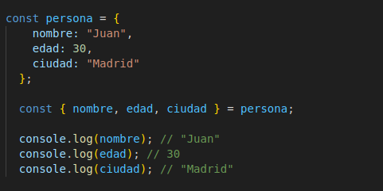
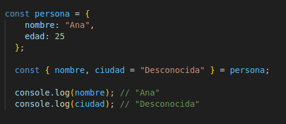
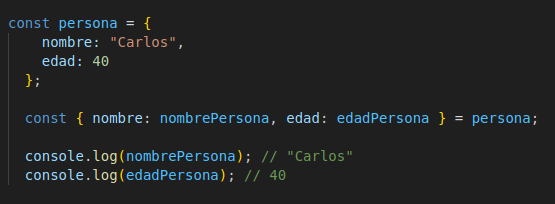

# Course Checkpoint 8


## ¿Qué tipo de bucles hay en JS?

hay varios tipos de bucles que se pueden usar para iterar sobre estructuras de datos o ejecutar un bloque de código repetidamente. Aquí están los principales tipos de bucles en JavaScript:

1. **Bucle for:** Es el bucle más común y se usa cuando se conoce el número de iteraciones de antemano.

    

    Imagina que quieres contar del 1 al 5 y escribir cada número en una hoja de papel. El bucle for es como decir: "Empieza en 1, y sigue escribiendo números hasta llegar a 5, aumentando de uno en uno."

    * let i = 1: Empieza en 1.

    * i <= 5: Continúa mientras el número sea menor o igual a 5.

    * i++: Aumenta el número en 1 cada vez.

    * console.log(i): Escribe el número en la hoja (o en la pantalla en este caso).

2. **Bucle while:** Se ejecuta siempre que la condición especificada sea verdadera.

    

    Mientras una condición sea verdadera, sigue haciendo algo." Por ejemplo, sigue contando mientras el número sea menor que 5.

    * let i = 1: Empieza en 1.
    * while (i <= 5): Mientras el número sea menor o igual a 5, sigue contando.
    * console.log(i): Escribe el número.
    * i++: Aumenta el número en 1 cada vez.


3. **Bucle do...while:** Similar a while, pero garantiza que el bloque de código se ejecute al menos una vez, ya que la condición se evalúa después de la primera iteración, incluso si la condición es falsa al principio.

    

    * let i = 1: Empieza en 1.
    * do { ... }: Haz esto al menos una vez.
    * console.log(i): Escribe el número.
    * i++: Aumenta el número en 1 cada vez.
    * while (i <= 5): Luego revisa si el número es menor o igual a 5 para decidir si repetir.

4. **Bucle for...in:** Se utiliza para iterar sobre las propiedades enumerables de un objeto.

    

    Imagina que tienes una lista de cosas con nombres y valores, como una lista de compras.

    Aquí está el código:

    

    * const objeto = {manzanas: 3, peras: 5, platanos: 2}: Este es tu objeto, como una lista de compras con cantidades.
    * for (let fruta in objeto): Para cada cosa en la lista (fruta en este caso).
    * console.log(fruta + ": " + objeto[fruta]): Escribe el nombre de la cosa y su cantidad.


5. **Bucle for...of:** Se utiliza para iterar sobre elementos de objetos iterables (como arrays, strings, maps, sets, etc.).

    


### Otros métodos de iteración

Además de los bucles tradicionales, JavaScript también ofrece métodos de iteración que son comunes en los arrays y otras colecciones:

* **Array.prototype.forEach:**: JEjecuta una función una vez por cada elemento de un array.

    

* **Array.prototype.map:**: Crea un nuevo array con los resultados de llamar a una función para cada elemento del array.

    

* **Array.prototype.filter:**: Crea un nuevo array con todos los elementos que pasen la prueba implementada por la función proporcionada.

    

Estos son los principales tipos de bucles y métodos de iteración en JavaScript, cada uno adecuado para diferentes situaciones y tipos de colecciones de datos.


## D¿Cuáles son las diferencias entre const, let y var?


### 1. `var`
- **Alcance de función**: Las variables declaradas con `var` tienen alcance de función. Esto significa que si se declaran dentro de una función, solo son accesibles dentro de esa función.
    ```javascript
    function ejemplo() {
        var x = 10;
        console.log(x); // 10
    }
    console.log(x); // Error: x is not defined
    ```
- **Hoisting**: Las variables declaradas con `var` se "elevan" al comienzo de su contexto, aunque su inicialización no se eleva.
    ```javascript
    console.log(y); // undefined
    var y = 5;
    ```
- **Re-declaración**: Puedes re-declarar la misma variable con `var` dentro del mismo contexto.
    ```javascript
    var z = 1;
    var z = 2; // No causa error
    console.log(z); // 2
    ```

### 2. `let`
- **Alcance de bloque**: Las variables declaradas con `let` tienen alcance de bloque, lo que significa que solo son accesibles dentro del bloque en el que se declararon (por ejemplo, dentro de `{}`).
    ```javascript
    if (true) {
        let a = 10;
        console.log(a); // 10
    }
    console.log(a); // Error: a is not defined
    ```
- **Hoisting**: Las variables declaradas con `let` también se elevan, pero no se inicializan. Acceder a ellas antes de su declaración genera un error de referencia.
    ```javascript
    console.log(b); // Error: Cannot access 'b' before initialization
    let b = 5;
    ```
- **No re-declaración**: No puedes re-declarar una variable con `let` dentro del mismo bloque.
    ```javascript
    let c = 1;
    let c = 2; // Error: Identifier 'c' has already been declared
    ```

### 3. `const`
- **Alcance de bloque**: Las variables declaradas con `const` también tienen alcance de bloque, al igual que `let`.
    ```javascript
    if (true) {
        const d = 10;
        console.log(d); // 10
    }
    console.log(d); // Error: d is not defined
    ```
- **Hoisting**: Las variables declaradas con `const` se elevan pero no se inicializan, similar a `let`. Acceder a ellas antes de su declaración genera un error de referencia.
    ```javascript
    console.log(e); // Error: Cannot access 'e' before initialization
    const e = 5;
    ```
- **No re-declaración y no reasignación**: No puedes re-declarar ni reasignar una variable declarada con `const`. Debe ser inicializada en el momento de su declaración.
    ```javascript
    const f = 1;
    f = 2; // Error: Assignment to constant variable.
    const f = 3; // Error: Identifier 'f' has already been declared
    ```
- **Inmutabilidad del valor**: Aunque `const` no permite la reasignación de la variable, si la variable es un objeto o un array, sus propiedades o elementos pueden ser modificados.
    ```javascript
    const obj = {prop: 1};
    obj.prop = 2; // Esto es permitido
    console.log(obj.prop); // 2
    ```

### Resumen de diferencias
- **Alcance**: `var` tiene alcance de función, mientras que `let` y `const` tienen alcance de bloque.
- **Hoisting**: `var` se eleva y se inicializa con `undefined`, mientras que `let` y `const` se elevan pero no se inicializan.
- **Re-declaración**: `var` permite re-declaración dentro del mismo contexto, `let` y `const` no.
- **Reasignación**: `let` permite reasignación, `const` no permite reasignación después de la inicialización.

## ¿Qué es una función de flecha?

Una función de flecha (arrow function) es una sintaxis concisa para definir funciones en JavaScript introducida en ECMAScript 6 (ES6). Las funciones de flecha tienen varias características que las diferencian de las funciones tradicionales (function), como una sintaxis más corta y un comportamiento léxico del contexto de this.

* **Sintaxis**

La sintaxis básica de una función de flecha es:


Si la función solo tiene un parámetro, los paréntesis pueden omitirse:


Si la función solo tiene una expresión, las llaves y la palabra clave return pueden omitirse. La expresión será devuelta automáticamente:


**Ejemplos**


Función tradicional vs. Función de flecha
Función tradicional:


Función de flecha:


**Sin parámetros**

Función tradicional:
```js
function saludar() {
    return "Hola";
}
```
Función de flecha:

```js
const saludar = () => "Hola";
```

**Un solo parámetro**
Función tradicional:

```js
function cuadrado(n) {
    return n * n;
}
```
Función de flecha:

```js
const cuadrado = n => n * n;
```

### Características

1. **Sintaxis concisa:** Como se puede ver en los ejemplos, las funciones de flecha permiten escribir funciones de manera más compacta.

2. **No binding de this:** A diferencia de las funciones tradicionales, las funciones de flecha no tienen su propio this. En lugar de ello, heredan this del contexto en el que fueron definidas. Esto es útil en muchos casos, especialmente al trabajar con métodos en objetos y callbacks.

    ```js
    function Persona() {
        this.edad = 0;

        setInterval(() => {
            this.edad++; // `this` se refiere al objeto Persona
        }, 1000);
    }

    const p = new Persona();
    ```

3. **No arguments object:** Las funciones de flecha no tienen un objeto arguments. Si necesitas acceder a los argumentos, puedes usar el operador de rest (...args).

    ```js
    const suma = (...args) => args.reduce((a, b) => a + b, 0);
    ```

4. **No new keyword:** Las funciones de flecha no pueden ser utilizadas como constructores y arrojarán un error si se intenta usar new con ellas.

    ```js
    const MiClase = () => {};
    const obj = new MiClase(); // Error: MiClase is not a constructor
    ```

5. No super: Las funciones de flecha no tienen su propio super, similar a this, lo cual las hace útiles en clases y herencia.

### Uso típico

Las funciones de flecha son comúnmente utilizadas para callbacks y funciones pequeñas, donde la sintaxis concisa y el comportamiento de this simplifican el código.

```js
const numeros = [1, 2, 3, 4, 5];
const dobles = numeros.map(n => n * 2);
console.log(dobles); // [2, 4, 6, 8, 10]
```

En resumen, las funciones de flecha en JavaScript proporcionan una forma más corta y clara de escribir funciones, especialmente cuando se trata de funciones pequeñas y callbacks, y manejan this de una manera que evita algunos problemas comunes con las funciones tradicionales.

## ¿Qué es la deconstrucción de variables?

La deconstrucción de variables (o desestructuración) es una característica de algunos lenguajes de programación, como JavaScript, que permite extraer valores de arreglos o propiedades de objetos y asignarlos a variables distintas de manera más concisa y legible. Esta técnica facilita el trabajo con estructuras de datos complejas, permitiendo una sintaxis más clara y directa para acceder a sus elementos.

### Deconstrucción en JavaScript

**Deconstrucción de Arreglos**

Permite extraer valores de un arreglo y asignarlos a variables individuales.




### Deconstrucción de Objetos

Permite extraer valores de un objeto y asignarlos a variables que tienen el mismo nombre que las propiedades del objeto.



### Beneficios de la Deconstrucción de Variables

1. **Código Más Claro y Conciso:** Reduce la cantidad de código necesario para extraer valores de estructuras de datos.

2. **Evita Repetición:** Minimiza la repetición de acceso a propiedades o índices.

3. **Mejora la Legibilidad:** Hace que el código sea más legible al facilitar la comprensión de qué datos están siendo manipulados.

### Ejemplos Avanzados

**Valores Predeterminados**

Se pueden asignar valores predeterminados a las variables durante la deconstrucción.



**Renombrado de Variables**

Se puede renombrar las variables al deconstruir objetos.



### Deconstrucción en Otros Lenguajes

Aunque el ejemplo se ha centrado en JavaScript, otros lenguajes como Python, PHP, y Swift también tienen mecanismos de desestructuración o deconstrucción de variables con sintaxis y características similares.

En resumen, la deconstrucción de variables es una técnica poderosa y flexible que mejora la eficiencia y legibilidad del código, especialmente cuando se trabaja con estructuras de datos complejas.


## ¿Qué hace el operador de extensión en JS?

El operador de extensión (spread operator) en JavaScript se representa con tres puntos (...) y tiene varios usos poderosos y versátiles para trabajar con arreglos, objetos, y parámetros de funciones. Aquí están los usos principales:

### 1.  Copia de Arreglos y Objetos

El spread operator se puede usar para crear copias superficiales de arreglos y objetos.

**Copia de Arreglos**

```js
const originalArray = [1, 2, 3];
const copyArray = [...originalArray];

console.log(copyArray); // [1, 2, 3]
console.log(copyArray === originalArray); // false (no es la misma referencia)
```

**Copia de Objetos**

```js
const originalObject = { a: 1, b: 2 };
const copyObject = { ...originalObject };

console.log(copyObject); // { a: 1, b: 2 }
console.log(copyObject === originalObject); // false (no es la misma referencia)
```

### 2. Combinar Arreglos y Objetos

El spread operator se puede usar para combinar o fusionar arreglos y objetos.

**Combinar Arreglos**

```js
const array1 = [1, 2];
const array2 = [3, 4];
const combinedArray = [...array1, ...array2];

console.log(combinedArray); // [1, 2, 3, 4]
```

**Combinar Objetos**

```js
const object1 = { a: 1, b: 2 };
const object2 = { c: 3, d: 4 };
const combinedObject = { ...object1, ...object2 };

console.log(combinedObject); // { a: 1, b: 2, c: 3, d: 4 }
```

### 3. Parámetros en Funciones

El spread operator se puede usar para expandir elementos de un arreglo como argumentos de una función.

```js
const numbers = [1, 2, 3];
const sum = (x, y, z) => x + y + z;

console.log(sum(...numbers)); // 6
```

### 4. Crear Nuevos Arreglos u Objetos con Elementos Adicionales

Permite crear nuevos arreglos u objetos añadiendo elementos adicionales.

**Nuevos Arreglos**

```js
const array = [1, 2, 3];
const newArray = [0, ...array, 4];

console.log(newArray); // [0, 1, 2, 3, 4]
```

**Nuevos Objetos**

```js
const object = { a: 1, b: 2 };
const newObject = { ...object, c: 3 };

console.log(newObject); // { a: 1, b: 2, c: 3 }
```

### 5. Desestructuración

El spread operator se puede usar en desestructuración para recoger el resto de elementos de un arreglo o propiedades de un objeto.

**Desestructuración de Arreglos**

```js
const [first, ...rest] = [1, 2, 3, 4];

console.log(first); // 1
console.log(rest); // [2, 3, 4]
```

**Desestructuración de Objetos**

```js
const { a, ...rest } = { a: 1, b: 2, c: 3 };

console.log(a); // 1
console.log(rest); // { b: 2, c: 3 }
```

En resumen, el operador de extensión es una herramienta poderosa en JavaScript que facilita muchas operaciones comunes con arreglos y objetos, mejorando la legibilidad y concisión del código.

## ¿Qué es la programación orientada a objetos?

La programación orientada a objetos (POO) en JavaScript es un paradigma de programación que se enfoca en el uso de "objetos" y "clases" para estructurar el código de manera modular y reutilizable. Aunque JavaScript es conocido como un lenguaje basado en prototipos, a partir de ECMAScript 6 (ES6), introdujo la sintaxis de clases, facilitando el uso de conceptos de POO más tradicionales.


### Principios Fundamentales de la POO

1. **Clases y Objetos:**

    * **Clase:** Es una plantilla para crear objetos. Define propiedades y métodos que los objetos creados a partir de la clase tendrán.

    * **Objeto:** Es una instancia de una clase, con su propio estado y comportamiento.

    ```js
    class Perro {
    constructor(nombre, edad) {
        this.nombre = nombre;
        this.edad = edad;
    }

    ladrar() {
        console.log('¡Guau!');
    }
    }

    const miPerro = new Perro('Firulais', 5);
    miPerro.ladrar();  // ¡Guau!
    ```

2. **Encapsulamiento:**

    Se refiere a ocultar los detalles internos de un objeto y exponer solo lo necesario. En JavaScript, los atributos pueden ser "privados" usando un guion bajo por convención, aunque con ES6 también se pueden usar campos privados reales usando el prefijo #.

    ```js
    class CuentaBancaria {
    #saldo;

    constructor(saldoInicial) {
        this.#saldo = saldoInicial;
    }

    depositar(cantidad) {
        this.#saldo += cantidad;
    }

    obtenerSaldo() {
        return this.#saldo;
    }
    }

    const miCuenta = new CuentaBancaria(1000);
    miCuenta.depositar(500);
    console.log(miCuenta.obtenerSaldo());  // 1500
    ```
3. **Herencia:**

    Permite que una clase herede propiedades y métodos de otra clase. Esto facilita la reutilización y extensión del código.

    ```js
    class Animal {
    constructor(nombre) {
        this.nombre = nombre;
    }

    hacerSonido() {
        console.log('Sonido de animal');
    }
    }

    class Perro extends Animal {
        hacerSonido() {
            console.log('¡Guau!');
        }
    }

    const miPerro = new Perro('Firulais');
    miPerro.hacerSonido();  // ¡Guau!
    ```

4. **Polimorfismo:**

    Permite que diferentes clases implementen métodos de la misma firma de maneras distintas, y que se puedan tratar de manera uniforme.

    ```js
    class Animal {
    hacerSonido() {
        console.log('Sonido de animal');
    }
    }

    class Perro extends Animal {
        hacerSonido() {
            console.log('¡Guau!');
        }
    }

    class Gato extends Animal {
        hacerSonido() {
            console.log('¡Miau!');
        }
    }

    const animales = [new Perro(), new Gato()];

    animales.forEach(animal => animal.hacerSonido());
    // ¡Guau!
    // ¡Miau!
    ```

### Uso de Prototipos
Antes de ES6, JavaScript implementaba POO principalmente a través de prototipos. Cada objeto tiene un prototipo, que es otro objeto del que hereda métodos y propiedades.

```js
function Perro(nombre, edad) {
   this.nombre = nombre;
   this.edad = edad;
}

Perro.prototype.ladrar = function() {
   console.log('¡Guau!');
};

const miPerro = new Perro('Firulais', 5);
miPerro.ladrar();  // ¡Guau!
```

### Ventajas de la POO en JavaScript

1. Modularidad: Facilita la organización del código en componentes pequeños y manejables.
2. Reutilización: Las clases y los objetos pueden ser reutilizados en diferentes partes del programa.
3. Mantenimiento: El código es más fácil de mantener y modificar gracias a su estructura clara y bien definida.
4. Escalabilidad: La POO permite extender y adaptar aplicaciones de manera más sencilla y eficiente.

En resumen, la programación orientada a objetos en JavaScript permite a los desarrolladores escribir código más estructurado, modular y reutilizable, utilizando conceptos como clases, herencia, encapsulamiento y polimorfismo. Con la introducción de la sintaxis de clases en ES6, trabajar con POO en JavaScript se ha vuelto más intuitivo y similar a otros lenguajes orientados a objetos.


## ¿Qué es una promesa en JS?

Una promesa en JavaScript es un objeto que representa la eventual finalización (o falla) de una operación asíncrona y su valor resultante. Las promesas permiten manejar operaciones asíncronas de una manera más organizada y legible, evitando el conocido problema de la "callback hell" (infierno de callbacks), donde las funciones anidadas crean un código difícil de seguir y mantener.

### Estados de una Promesa
Una promesa puede estar en uno de tres estados:

1. Pending (Pendiente): El estado inicial de la promesa. La operación asíncrona aún no ha finalizado.
2. Fulfilled (Cumplida): La operación asíncrona se ha completado con éxito, y la promesa tiene un valor resultante.
3. Rejected (Rechazada): La operación asíncrona ha fallado, y la promesa tiene una razón de fallo (error).

### Creación de una Promesa

Una promesa se crea usando el constructor Promise, que toma una función ejecutora como argumento. Esta función ejecutora recibe dos funciones, resolve y reject, que se utilizan para cambiar el estado de la promesa.

```js
const miPromesa = new Promise((resolve, reject) => {
    // Operación asíncrona (por ejemplo, una solicitud a un servidor)
    const exito = true; // Simulación de éxito o fallo

    if (exito) {
        resolve('Operación completada con éxito');
    } else {
        reject('Hubo un error en la operación');
    }
});
```

### Consumo de una Promesa
Para manejar el resultado de una promesa, se utilizan los métodos then y catch.

* then: Se ejecuta cuando la promesa se cumple (fulfilled).
* catch: Se ejecuta cuando la promesa es rechazada (rejected).

```js
miPromesa
    .then(resultado => {
        console.log(resultado); // 'Operación completada con éxito'
    })
    .catch(error => {
        console.error(error); // 'Hubo un error en la operación'
    });
```

### Promesas Encadenadas

Las promesas pueden encadenarse para manejar secuencias de operaciones asíncronas de manera más legible.

```js
const promesaCadena = new Promise((resolve, reject) => {
    resolve(10);
});

promesaCadena
    .then(resultado => {
        console.log(resultado); // 10
        return resultado * 2;
    })
    .then(resultado => {
        console.log(resultado); // 20
        return resultado * 2;
    })
    .then(resultado => {
        console.log(resultado); // 40
    })
    .catch(error => {
        console.error(error);
    });
```

### Promise.all, Promise.race, Promise.allSettled, Promise.any
JavaScript proporciona métodos adicionales para trabajar con múltiples promesas:

* **Promise.all:** Espera a que todas las promesas se cumplan o alguna sea rechazada. Retorna una nueva promesa que se cumple con un arreglo de los resultados cuando todas las promesas se cumplen, o se rechaza con el motivo de rechazo de la primera promesa que sea rechazada.

```js
const promesa1 = Promise.resolve(3);
const promesa2 = 42;
const promesa3 = new Promise((resolve, reject) => {
    setTimeout(resolve, 100, 'foo');
});

Promise.all([promesa1, promesa2, promesa3]).then(valores => {
    console.log(valores); // [3, 42, "foo"]
});
```

* **Promise.race:** Retorna una nueva promesa que se cumple o se rechaza tan pronto como una de las promesas en el iterable se cumple o se rechaza.

```js
const promesaA = new Promise((resolve, reject) => {
    setTimeout(resolve, 500, 'uno');
});

const promesaB = new Promise((resolve, reject) => {
    setTimeout(resolve, 100, 'dos');
});

Promise.race([promesaA, promesaB]).then(valor => {
    console.log(valor); // "dos"
});
```

* **Promise.allSettled:** Espera hasta que todas las promesas hayan sido cumplidas o rechazadas. Retorna una promesa que se cumple con un arreglo de los resultados de cada promesa.

```js
const promesa1 = Promise.resolve(3);
const promesa2 = new Promise((resolve, reject) => {
    setTimeout(reject, 100, 'error');
});

Promise.allSettled([promesa1, promesa2]).then(resultados => {
    resultados.forEach((resultado) => console.log(resultado.status));
    // "fulfilled"
    // "rejected"
});
```

* **Promise.any:** Espera hasta que alguna de las promesas se cumpla. Retorna una promesa que se cumple con el valor de la primera promesa que se cumple, o se rechaza si todas las promesas son rechazadas.

```js
const promesa1 = Promise.reject('error');
const promesa2 = new Promise((resolve) => setTimeout(resolve, 100, 'success'));

Promise.any([promesa1, promesa2]).then(valor => {
    console.log(valor); // "success"
}).catch(error => {
    console.log(error);
});
```
En resumen, las promesas en JavaScript son una forma poderosa de manejar operaciones asíncronas, ofreciendo una sintaxis más clara y manejable en comparación con los callbacks tradicionales.

## ¿Qué hacen async y await por nosotros?

Las palabras clave async y await en JavaScript se introdujeron en ECMAScript 2017 (ES8) y permiten escribir código asíncrono de una manera más clara y sencilla, que se asemeja al código sincrónico. Estas características son azúcares sintácticas sobre las promesas, lo que facilita la lectura y el manejo de operaciones asíncronas.

### `async`

La palabra clave async se utiliza para declarar una función asíncrona. Una función marcada con async siempre devuelve una promesa. Si la función devuelve un valor, esa promesa se resolverá con el valor devuelto. Si la función lanza una excepción, la promesa se rechazará con el valor lanzado.

```js
async function miFuncion() {
    return '¡Hola!';
}

miFuncion().then(resultado => {
    console.log(resultado); // ¡Hola!
});
```

En el ejemplo anterior, miFuncion devuelve una promesa que se resuelve con el valor '¡Hola!'.

### `await`

La palabra clave await se usa dentro de funciones async para esperar la resolución de una promesa. await detiene la ejecución de la función asíncrona hasta que la promesa se resuelva o sea rechazada, y luego reanuda la ejecución con el valor resuelto o lanza un error si la promesa fue rechazada.

```js
async function obtenerDatos() {
    let response = await fetch('https://api.example.com/data');
    let data = await response.json();
    return data;
}

obtenerDatos().then(data => {
    console.log(data);
}).catch(error => {
    console.error('Error:', error);
});
```

**En el ejemplo anterior:**

1. **`fetch`** devuelve una promesa que se resuelve con el objeto Response de la red.
2. **`await fetch(...)`** detiene la ejecución de obtenerDatos hasta que la promesa se resuelva.
3. **`response.json()`** devuelve una promesa que se resuelve con el cuerpo de la respuesta parseado como JSON.
3. **`await response.json()`** detiene nuevamente la ejecución hasta que la promesa se resuelva con los datos JSON.

### Manejo de Errores

El manejo de errores en funciones async se puede realizar usando try...catch, lo que permite una forma más estructurada y legible de manejar errores en comparación con catch en promesas.

```js
async function obtenerDatosSeguros() {
    try {
        let response = await fetch('https://api.example.com/data');
        if (!response.ok) {
            throw new Error('Error en la solicitud');
        }
        let data = await response.json();
        return data;
    } catch (error) {
        console.error('Error:', error);
        throw error;
    }
}

obtenerDatosSeguros().then(data => {
    console.log(data);
}).catch(error => {
    console.error('Manejo de error en llamada:', error);
});
```

En este ejemplo, cualquier error en la solicitud fetch o en la conversión a JSON se captura en el bloque catch, y el error se lanza nuevamente para que pueda ser manejado por el código que llama a obtenerDatosSeguros.

### Beneficios de `async` y `await`

1. **Código más legible y mantenible:** La sintaxis de async y await permite escribir código asíncrono de una manera que se parece mucho al código sincrónico, lo que lo hace más fácil de leer y entender.

2. **Manejo de errores simplificado:** La combinación de async y await con try...catch proporciona una forma clara y estructurada de manejar errores.

3. **Evita el callback hell:** Simplifica el manejo de múltiples operaciones asíncronas secuenciales sin la necesidad de anidar callbacks o encadenar múltiples then.

En resumen, `async` y `await` proporcionan una forma más sencilla y directa de trabajar con operaciones asíncronas en JavaScript, mejorando la legibilidad y la mantenibilidad del código.


    


